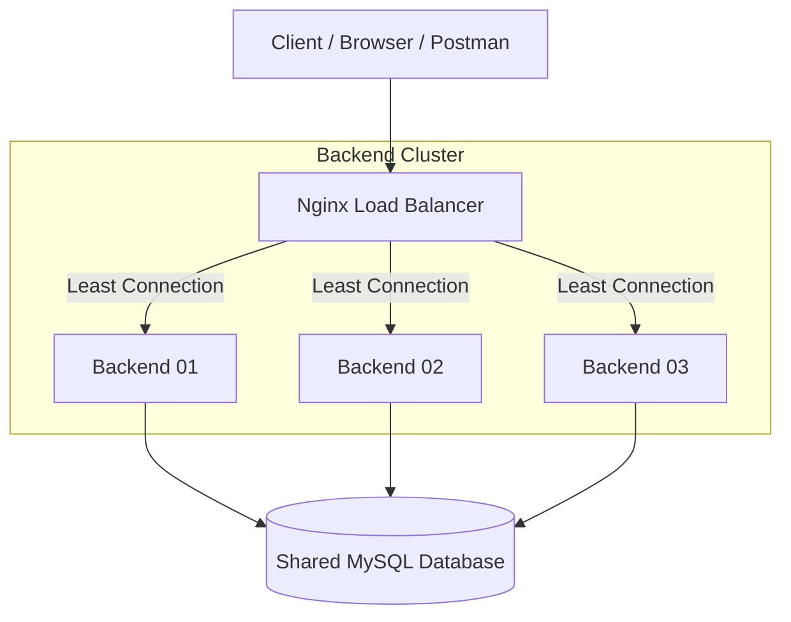

# 🌐 Distributed System Practicum - Midterm Exam

[](https://laravel.com)
[](https://www.docker.com)
[](https://nginx.org)

A robust, containerized distributed system featuring a multi-backend architecture with automated load balancing and shared database persistence.

---

## 🏗️ System Architecture

The following diagram illustrates the request flow and service structure of the project:



---

## 💎 Features

- **Distributed Backends**: 3 identical Laravel instances running in sync.
- **Dynamic Identity Detection**: Servers automatically identify themselves via container hostnames.
- **Intelligent Load Balancing**: Nginx logic ensures efficient resource utilization.
- **Shared Data Integrity**: Centralized logging of all requests across the cluster.
- **Dry Configuration**: Optimized Docker environment using YAML anchors and centralized `.env`.

---

## 🆔 Student Compliance (NIM: 458362203061)

This project strictly follows the configuration rules derived from NIM **458362203061**:

| Parameter | Assigned Value | Rule Basis |
| :--- | :--- | :--- |
| **Backend Servers** | 3 Servers | Last Digit (1) in range 0-2 |
| **Application Ports** | 8000 - 8004 | Last Digit (1) in range 0-3 |
| **Load Balancer** | Least Connection | Odd Last Digit (1) |

---

## 🚀 Getting Started

### 1. Prerequisites
- Docker & Docker Compose
- Postman (for testing)

### 2. Installation
Clone this repository and set up the environment:
```bash
# Clone the project (if applicable)
cd distributed-system-project

# Setup environment
cp .env.example .env

# Start the cluster
docker compose up -d
```

### 3. Database Migration
Initialize the shared database schema:
```bash
docker compose exec backend1 php artisan migrate --force
```

---

## 📡 API Reference

| Endpoint | Method | Description |
| :--- | :--- | :--- |
| `/api/server-info` | `GET` | Get identity and metadata of the handling server. |
| `/api/health` | `GET` | Standard health check. |
| `/api/requests` | `POST` | Save a message log to the cluster. |
| `/api/requests` | `GET` | View the global log history of all backends. |

---

## 🧪 Testing

### Postman Collection
A pre-configured Postman collection is available at:
`docs/Distributed_System.postman_collection.json`

### Direct Access
For debugging purposes, each backend can be accessed directly bypassing the Load Balancer:
- **Backend 01**: `http://localhost:8001`
- **Backend 02**: `http://localhost:8002`
- **Backend 03**: `http://localhost:8003`
- **Load Balancer**: `http://localhost:8000`

---

## 🛠️ Management Commands
- **Start**: `docker compose up -d`
- **Stop**: `docker compose down`
- **Logs**: `docker compose logs -f`
- **Status**: `docker compose ps`

---
*Created by bugkey24 for the Distributed Systems Practicum.*
