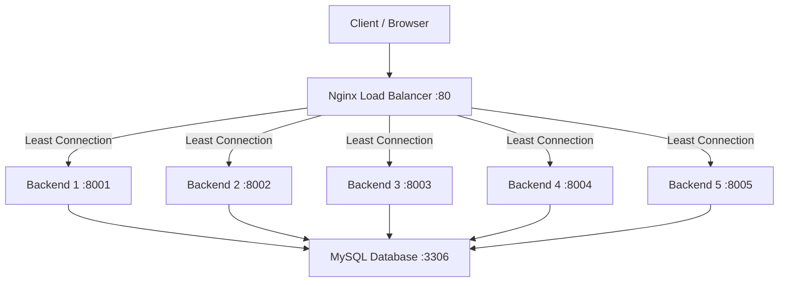

## 📘 Software Requirements Specification (SRS) Documentation for the Distributed Systems Practicum Midterm Exam

---

### 1. Introduction

#### 1.1 Objectives

This document provides complete documentation for the Distributed Systems Practicum Midterm Exam, which aims to implement a Docker-based distributed system with multiple Laravel backend servers and Nginx as a load balancer.

#### 1.2 Scope

The system includes:

1. Creating a simple REST API with Laravel 12
2. Integration with a MySQL database
3. Containerizing all services using Docker
4. Implementing five identical backend servers
5. Configuring Nginx as a load balancer
6. Testing request distribution

#### 1.3 Configuration Based on Student ID

| Parameters                | Values ​​                      |
| ------------------------- | ------------------------------ |
| Student ID                | **362458302061**               |
| Last Digit                | **1**                          |
| Number of Backend Servers | **5 servers** (digits 0-2)     |
| Application Port          | **8000-8004** (digits 0-3)     |
| Load Balancing Method     | **Least Connection** (odd NIM) |

---

### 2. General System Description

#### 2.1 System Architecture

The implemented distributed system has the following architecture:



#### 2.2 System Components

| Components        | Technology     | Version | Description                      |
| ----------------- | -------------- | ------- | -------------------------------- |
| Backend Framework | Laravel        | 12.x    | REST API servers                 |
| PHP Runtime       | PHP-FPM        | 8.3     | PHP execution environment        |
| Databases         | MySQL          | 8.0     | Persistent data storage          |
| Web Server        | Nginx          | alpine  | Load balancers & reverse proxies |
| Containerization  | Docker         | 27.x    | Container runtime                |
| Orchestration     | Docker Compose | v2      | Multi-container management       |

#### 2.3 Reasons for Selecting Least Connection

Based on **Odd NIM (362458302061 → digit 1)**, the load balancing method used is **Least Connection**. This method directs requests to the backend server with the fewest active connections, making it ideal for:

- Requests with variable processing times (such as database operations)
- Preventing overload on busy servers
- Fairer load distribution for dynamic applications like Laravel

---

### 3. Development Environment Preparation

#### 3.1 System Prerequisites

| Software       | Minimum Version | Installation                                                      |
| -------------- | --------------- | ----------------------------------------------------------------- |
| Docker         | 24.0+           | [docs.docker.com/get-docker](https://docs.docker.com/get-docker/) |
| Docker Compose | 2.20+           | Included in Docker Desktop                                        |
| Git            | 2.40+           | [git-scm.com](https://git-scm.com/)                               |
| Composer       | 2.6+            | [getcomposer.org](https://getcomposer.org/)                       |

#### 3.2 Verify Installation

```bash
docker --version # Docker version 27.x
docker compose version # Docker Compose version v2.x
git --version # git version 2.x
php --version # PHP 8.3+ (optional for local development)
composer --version # Composer version 2.x
```

---

### 4. Project Structure

```
distributed-system-project/
├── src/ # Laravel application source code
│ ├── app/
│ │ ├── Http/
│ │ │ └── Controllers/
│ │ │ ├── Fire/
│ │ │ │ └── InfoController.php # API endpoint for server identity
│ │ │ └── Controller.php
│ │ └── Models/
│ ├── bootstrap/
│ ├── config/
│ ├── database/
│ │ ├── migrations/
│ │ │ └── 2024_01_01_000000_create_requests_table.php
│ │ └── seeders/
│ ├── public/
│ ├── resources/
│ ├── routes/
│ │ ├── api.php # API route definitions
│ │ └── web.php
│ ├── storage/
│ ├── .env # Laravel environment
│ ├── .env.example
│ ├── composer.json
│ └── artisan
│
├── docker/ # Docker configuration files
│ ├── php/
│ │ └── Dockerfile # PHP-FPM custom image
│ ├── nginx/
│ │ └── default.conf # Nginx load balancer configuration
│ └── mysql/
│ └── init.sql
# Database initialization script
│
├── docker-compose.yml # Docker Compose orchestration
├── Makefile # Utility commands
├── .env.docker # Docker environment variables
├── .gitignore
└── README.md
```

---

### 5. Implementation

#### 5.1 Create a Laravel Project

```bash
# 1. Create a project directory
mkdir distributed-system-project && cd distributed-system-project

# 2. Create a Laravel project in the src/ folder
composer create-project laravel/laravel src

# 3. Go to the src folder and setup
cd src
php artisan key:generate
```

#### 5.2 Create an API Endpoints

**File: `src/routes/api.php`**

```php
<?php

use Illuminate\Support\Facades\Route;
use App\Http\Controllers\Api\InfoController;

Route::get('/server-info', [InfoController::class, 'index']);
Route::get('/health', [InfoController::class, 'health']);
Route::post('/requests', [InfoController::class, 'store']);
Route::get('/requests', [InfoController::class, 'list']);
```

**File: `src/app/Http/Controllers/Api/InfoController.php`**

```php
<?php

namespace App\Http\Controllers\Api;

use App\Http\Controllers\Controller;
use App\Models\RequestLog;
use Illuminate\Http\Request;
use Illuminate\Support\Facades\DB;

class InfoController extends Controller
{
/**
* Displays information on the server that is serving the request
*/
public function index(Request $request)
{
$containerId = gethostname();
$serverIp = $_SERVER['SERVER_ADDR'] ?? gethostbyname($containerId);
$serverPort = $_SERVER['SERVER_PORT'] ?? '9000';

// Log requests to the database
RequestLog::create([
'container_id' => $containerId,
'endpoint' => '/api/server-info',
'method' => $request->method(),
'client_ip' => $request->ip(),
'user_agent' => $request->userAgent(),
]);

return response()->json([
'status' => 'success',
'server' => [
'id' => $containerId,
'name' => env('SERVER_NAME', 'Backend-' . substr($containerId, 0, 8)),
'ip' => $serverIp,
'port' => $serverPort,
'php_version' => PHP_VERSION,
'laravel_version' => app()->version(),
],
'timestamp' => now()->toIso8601String(),
'database_connected' => DB::connection()->getPdo() ? true : false,
]);
}

/**
* Health check endpoints
*/
public function health()
{
return response()->json([
'status' => 'healthy',
'container' => gethostname(),
'timestamp' => now()->toIso8601String(),
]);
}

/**
* Save request data (example POST endpoint)
*/
public function store(Request $request)
{
$validated = $request->validate([
'message' => 'required|string|max:255',
]);

$log = RequestLog::create([
'container_id' => gethostname(),
'endpoint' => '/api/requests',
'method' => $request->method(),
'client_ip' => $request->ip(),
'payload' => json_encode($validated),
]);

return response()->json([
'status' => 'success',
'message' => 'Saved data',
'server' => gethostname(),
'data' => $log,
], 201);
}

/**
* Displays request history
*/
public function list()
{
$logs = RequestLog::orderBy('created_at', 'desc')
->limit(50)
->get();

return response()->json([
'status' => 'success',
'server' => gethostname(),
'total' => $logs->count(),
'data' => $logs,
]);
}
}
```

#### 5.3 Creating Models and Migration

**File: `src/database/migrations/2024_01_01_000000_create_requests_table.php`**

```php
<?php

use Illuminate\Database\Migrations\Migration;
use Illuminate\Database\Schema\Blueprint;
use Illuminate\Support\Facades\Schema;

return new class extends Migration
{
public function up(): void
{
Schema::create('request_logs', function (Blueprint $table) {
$table->id();
$table->string('container_id');
$table->string('endpoint');
$table->string('method', 10);
$table->string('client_ip', 45)->nullable();
$table->text('user_agent')->nullable();
$table->json('payload')->nullable();
$table->timestamps();

$table->index('container_id');
$table->index('created_at');
});
}

public function down(): void
{
Schema::dropIfExists('request_logs');
}
};
```

**File: `src/app/Models/RequestLog.php`**

```php
<?php

namespace App\Models;

use Illuminate\Database\Eloquent\Factories\HasFactory;
use Illuminate\Database\Eloquent\Model;

class RequestLog extends Model
{
use HasFactory;

protected $fillable
= [
'container_id',
'endpoint',
'method',
'client_ip',
'user_agent',
'payload',
];

protected $casts = [
'payload' => 'array',
];
}
```

#### 5.4 Laravel Environment Configuration

**File: `src/.env` (database section)**

```env
APP_NAME="DistributedSystem"
APP_ENV=local
APP_DEBUG=true
APP_URL=http://localhost:8000

DB_CONNECTION=mysql
DB_HOST=mysql
DB_PORT=3306
DB_DATABASE=distributed_db
DB_USERNAME=laravel
DB_PASSWORD=secret123

CACHE_DRIVER=file
QUEUE_CONNECTION=sync
SESSION_DRIVER=file
```

#### 5.5 PHP-FPM Dockerfile

**File: `docker/php/Dockerfile`**

```dockerfile
# Multi-stage build for size optimization image
FROM php:8.3-fpm-alpine AS base

# Install system dependencies
RUN apk add --no-cache\
nginx\
supervisor\
libpng-dev\
libjpeg-turbo-dev\
freetype-dev\
oniguruma-dev\
libxml2-dev\
libzip-dev\
zip\
unzip\
curl\
git\
mysql-client

# Configure and install PHP extensions
RUN docker-php-ext-configure gd --with-freetype --with-jpeg \
&& docker-php-ext-install -j$(nproc) \
pdo_mysql \
mbstring \
exif\
pcntl\
bcmath\
gd\
opcache\
zip

# Copy Composer from the official image
COPY --from=composer:2 /usr/bin/composer /usr/bin/composer

# Set working directory
WORKDIR /var/www/html

# Copy application files
COPY ./src /var/www/html

# Set proper permissions (according to Laravel best practices)
RUN chown -R www-data:www-data /var/www/html \
&& chmod -R 775 /var/www/html/storage \
&& chmod -R 775 /var/www/html/bootstrap/cache

# PHP-FPM optimization for production
RUN echo "pm = dynamic" >> /usr/local/etc/php-fpm.d/www.conf\
&& echo "pm.max_children = 50" >> /usr/local/etc/php-fpm.d/www.conf \
&& echo "pm.start_servers = 5" >> /usr/local/etc/php-fpm.d/www.conf\
&& echo "pm.min_spare_servers = 5" >> /usr/local/etc/php-fpm.d/www.conf \
&& echo "pm.max_spare_servers = 35" >> /usr/local/etc/php-fpm.d/www.conf

EXPOSE 9000

CMD ["php-fpm"]
```

#### 5.6 Docker Compose Configuration

**File: `docker-compose.yml`**

```yaml
version: "3.9"

# Networks
networks:
distributed-network:
driver: bridge
name: distributed-network

# Volumes
volumes:
mysql-data:
driver: local
name: distributed-mysql-data

# Services
services:
# ==========================================================
# MySQL Database Service
# ==========================================================
mysql:
image: mysql:8.0
container_name: distributed-mysql
restart: unless-stopped
environment:
MYSQL_ROOT_PASSWORD: rootsecret123
MYSQL_DATABASE: distributed_db
MYSQL_USER: laravel
MYSQL_PASSWORD: secret123
ports:
- "3307:3306"
volumes:
- mysql-data:/var/lib/mysql
- ./docker/mysql/init.sql:/docker-entrypoint-initdb.d/init.sql:ro
networks:
- distributed-network
healthcheck:
test:
[
"CMD",
"mysqladmin",
"ping",
"-h",
"localhost",
"-u",
"root",
"-p$$MYSQL_ROOT_PASSWORD",
]
interval: 10s
timeout: 5s
retries: 5
start_period: 30s
commands:
- --character-set-server=utf8mb4
- --collation-server=utf8mb4_unicode_ci
- --default-authentication-plugin=mysql_native_password

# ==========================================================
# Backend Server 1
# ==========================================================
backend1:
build:
context: .
dockerfile: docker/php/Dockerfile
container_name: distributed-backend-1
restart: unless-stopped
environment:
SERVER_NAME: "Backend-01"
SERVER_PORT: "9000"
DB_CONNECTION: mysql
DB_HOST: mysql
DB_PORT: 3306
DB_DATABASE: distributed_db
DB_USERNAME: laravel
DB_PASSWORD: secret123
APP_ENV: local
APP_DEBUG: "true"
APP_KEY: ${APP_KEY}
volumes:
- ./src:/var/www/html
networks:
- distributed-network
depends_on:
mysql:
condition: service_healthy
healthcheck:
test: ["CMD", "php-fpm", "-t"]
interval: 30s
timeout: 10s
retries: 3

# ==========================================================
# Backend Server 2
# ==========================================================
backend2:
build:
context: .
dockerfile: docker/php/Dockerfile
container_name: distributed-backend-2
restart: unless-stopped
environment:
SERVER_NAME: "Backend-02"
SERVER_PORT: "9000"
DB_CONNECTION: mysql
DB_HOST: mysql
DB_PORT: 3306
DB_DATABASE: distributed_db
DB_USERNAME: laravel
DB_PASSWORD: secret123
APP_ENV: local
APP_DEBUG: "true"
APP_KEY: ${APP_KEY}
volumes:
- ./src:/var/www/html
networks:
- distributed-network
depends_on:
mysql:
condition: service_healthy

# ============================================
# Backend Server 3
# ==========================================================
backend3:
build:
context: .
dockerfile: docker/php/Dockerfile
container_name: distributed-backend-3
restart: unless-stopped
environment:
SERVER_NAME: "Backend-03"
SERVER_PORT: "9000"
DB_CONNECTION: mysql
DB_HOST: mysql
DB_PORT: 3306
DB_DATABASE: distributed_db
DB_USERNAME: laravel
DB_PASSWORD: secret123
APP_ENV: local
APP_DEBUG: "true"
APP_KEY: ${APP_KEY}
volumes:
- ./src:/var/www/html
networks:
- distributed-network
depends_on:
mysql:
condition: service_healthy

# ==========================================================
# Backend Server 4
# ==========================================================
backend4:
build:
context: .
dockerfile: docker/php/Dockerfile
container_name: distributed-backend-4
restart: unless-stopped
environment:
SERVER_NAME: "Backend-04"
SERVER_PORT: "9000"
DB_CONNECTION: mysql
DB_HOST: mysql
DB_PORT: 3306
DB_DATABASE: distributed_db
DB_USERNAME: laravel
DB_PASSWORD: secret123
APP_ENV: local
APP_DEBUG: "true"
APP_KEY: ${APP_KEY}
volumes:
- ./src:/var/www/html
networks:
- distributed-network
depends_on:
mysql:
condition: service_healthy

# ==========================================================
# Backend Server 5
# ==========================================================
backend5:
build:
context: .
dockerfile: docker/php/Dockerfile
container_name: distributed-backend-5
restart: unless-stopped
environment:
SERVER_NAME: "Backend-05"
SERVER_PORT: "9000"
DB_CONNECTION: mysql
DB_HOST: mysql
DB_PORT: 3306
DB_DATABASE: distributed_db
DB_USERNAME: laravel
DB_PASSWORD: secret123
APP_ENV: local
APP_DEBUG: "true"
APP_KEY: ${APP_KEY}
volumes:
- ./src:/var/www/html
networks:
- distributed-network
depends_on:
mysql:
condition: service_healthy

# ==========================================================
# Nginx Load Balancer
# ==========================================================
nginx:
image: nginx:alpine
container_name: distributed-nginx
restart: unless-stopped
ports:
- "8000:80" # Main load balancer port
- "8001:8001" # Direct access backend 1 (for testing)
- "8002:8002" # Direct access backend 2
- "8003:8003" # Direct access backend 3
- "8004:8004" # Direct access backend 4
volumes:
- ./docker/nginx/default.conf:/etc/nginx/conf.d/default.conf:ro
- ./src/public:/var/www/html/public:ro
networks:
- distributed-network
depends_on:
- backend1
- backend2
- backend3
- backend4
- backend5
healthcheck:
test: ["CMD", "nginx", "-t"]
interval: 30s
timeout: 10s
retries: 3
```

#### 5.7 Nginx Load Balancer Configuration

**File: `docker/nginx/default.conf`**

```nginx
# Upstream block with 5 backend servers
# Using the Least Connection method (according to odd NIM)
upstream backend_pool {
least_conn;

#5 Backend servers
backend server1:9000 max_fails=3 fail_timeout=30s;
backend server2:9000 max_fails=3 fail_timeout=30s;
backend server3:9000 max_fails=3 fail_timeout=30s;
backend server4:9000 max_fails=3 fail_timeout=30s;
backend server5:9000 max_fails=3 fail_timeout=30s;

# Keepalive connections for efficiency
keepalive 32;
}

# Main server block (Load Balancer)
server {
listen 80;
server_name localhost;

# Logging for monitoring
access_log /var/log/nginx/access.log;
error_log /var/log/nginx/error.log;

# Root for static files
root /var/www/html/public;
index index.php index.html;

# Limit the size of the request body
client_max_body_size 10M;

# Proxy headers to forward client information
proxy_set_header Host $host;
proxy_set_header X-Real-IP $remote_addr;
proxy_set_header X-Forwarded-For $proxy_add_x_forwarded_for;
proxy_set_header X-Forwarded-Proto $scheme;
proxy_set_header X-Forwarded-Host $host;
proxy_set_header X-Forwarded-Port $server_port;

# Timeout settings
proxy_connect_timeout 60s;
proxy_send_timeout 60s;
proxy_read_timeout 60s;

# Buffering settings
proxy_buffering on;
proxy_buffer_size 4k;
proxy_buffers 8 4k;
proxy_busy_buffers_size 8k;

# Main location - proxy to backend pool
location / {
try_files $uri $uri/ /index.php?$query_string;
}

# PHP handling - proxy to PHP-FPM backend pool
location ~ \.php$ {
include fastcgi_params;
fastcgi_pass backend_pool;
fastcgi_index index.php;
fastcgi_param SCRIPT_FILENAME $document_root$fastcgi_script_name;
fastcgi_param PATH_INFO $fastcgi_path_info;

# FastCGI optimizations
fastcgi_buffers 16 16k;
fastcgi_buffer_size 32k;
fastcgi_read_timeout 60s;
fastcgi_connect_timeout 60s;
fastcgi_send_timeout 60s;
}

# Static files - served directly by Nginx
location ~* \.(jpg|jpeg|png|gif|ico|css|js|svg|woff|woff2|ttf|eot)$ {
expires 30d;
add_header Cache-Control "public, immutable";
try_files $uri =404;
}

# Deny access to hidden files
location ~ /\. {
deny all;
access_log off;
log_not_found off;
}
}

# Endpoint status for Nginx monitoring
server {
listen 8080;
server_name localhost;

location /nginx_status {
stub_status on;
access_log off;
allow 127.0.0.1;
allow 172.0.0.0/8;
deny all;
}

location /health {
access_log off;
return 200 "healthy\n";
add_header Content-Type text/plain;
}
}

# Direct access server blocks for each backend (testing)
# Backend 1 - Port 8001
server {
listen 8001;
server_name localhost;

location / {
include fastcgi_params;
fastcgi_pass backend1:9000;
fastcgi_param SCRIPT_FILENAME /var/www/html/public/index.php;
}
}

# Backend 2 - Port 8002
server {
listen 8002;
server_name localhost;

location / {
include fastcgi_params;
fastcgi_pass backend2:9000;
fastcgi_param SCRIPT_FILENAME /var/www/html/public/index.php;
}
}

# Backend 3 - Port 8003
server {
listen 8003;
server_name localhost;

location / {
include fastcgi_params;
fastcgi_pass backend3:9000;
fastcgi_param SCRIPT_FILENAME /var/www/html/public/index.php;
}
}

# Backend 4 - Port 8004
server {
listen 8004;
server_name localhost;

location / {
include fastcgi_params;
fastcgi_pass backend4:9000;
fastcgi_param SCRIPT_FILENAME /var/www/html/public/index.php;
}
}
```

> **Note**: The direct access configuration above uses ports **8001-8004** to access each backend directly (useful for testing). Port **8000** is the load balancer's primary entry point.

#### 5.8 Database Initialization

**File: `docker/mysql/init.sql`**

```sql
-- Initialize the database for a distributed system
CREATE DATABASE IF NOT EXISTS distributed_db;
GRANT ALL PRIVILEGES ON distributed_db.* TO 'laravel'@'%';
FLUSH PRIVILEGES;

USE distributed_db;

-- Table for logging requests (if migration is not running)
CREATE TABLE IF NOT EXISTS request_logs (
id BIGINT UNSIGNED AUTO_INCREMENT PRIMARY KEY,
container_id VARCHAR(255) NOT NULL,
endpoint VARCHAR(255) NOT NULL,
method VARCHAR(10) NOT NULL,
client_ip VARCHAR(45),
user_agent TEXT,
JSON payloads,
created_at TIMESTAMP DEFAULT CURRENT_TIMESTAMP,
updated_at TIMESTAMP DEFAULT CURRENT_TIMESTAMP ON UPDATE CURRENT_TIMESTAMP,
INDEX idx_container (container_id),
INDEX idx_created (created_at)
) ENGINE=InnoDB DEFAULT CHARSET=utf8mb4 COLLATE=utf8mb4_unicode_ci;
```

#### 5.9 Environment Variables

**File: `.env.docker`**

```env
# Docker Environment Variables
# Copy this to .env and adjust as needed

# Application Key (generate with: php artisan key:generate)
APP_KEY=base64:YOUR_GENERATED_APP_KEY_HERE

# Database Configuration
DB_DATABASE=distributed_db
DB_USERNAME=laravel
DB_PASSWORD=secret123
DB_ROOT_PASSWORD=rootsecret123

# Port Configuration
NGINX_PORT=8000
MYSQL_PORT=3307

# Servers Names
BACKEND1_NAME=Backend-01
BACKEND2_NAME=Backend-02
BACKEND3_NAME=Backend-03
BACKEND4_NAME=Backend-04
BACKEND5_NAME=Backend-05
```

#### 5.10 Makefile (Utility Commands)

**File: `Makefile`**

```makefile
# Makefile for Distributed System Project
# Distributed Systems Practicum UTS - NIM: 362458302061

.PHONY: help build up down restart logs clean test status scale

# Default target
help:
@echo "Distributed Systems - UTS Practicum"
@echo ""
@echo "Usage: make [target]"
@echo ""
@echo "Targets:"
@echo " build Build all Docker images"
@echo "up" Start all containers"
@echo "down" Stop and remove all containers"
@echo "restart" Restart all containers"
@echo "logs" Show logs from all containers"
@echo "logs-lb" Show Nginx load balancer logs"
@echo "logs-backend" Show logs from all backends"
@echo "status" Show status of all containers"
@echo "clean" Clean all containers, images, and volumes"
@echo "test" Run request distribution test"
@echo "test-load" Test with load (100 requests)"
@echo "scale" Scale backend services"
@echo "setup" Setup Laravel (migrate, key generate)"
@echo "shell" Log into backend1 container"

# Build images
build:
@echo "🔨 Building Docker images..."
docker compose build --no-cache

# Start containers
up:
@echo "🚀 Starting distributed system..."
docker compose up -d
@echo "✅ System started!"
@echo "Load Balancer: http://localhost:8000"
@echo "Backend 1: http://localhost:8001"
@echo "Backend 2: http://localhost:8002"
@echo "Backend 3: http://localhost:8003"
@echo "Backend 4: http://localhost:8004"
@echo ""
@echo "Test endpoint: curl http://localhost:8000/api/server-info"

# Stop and remove containers
down:
@echo "🛑 Stopping distributed system..."
docker compose down

# Restart containers
restart: down up

# View logs
logs:
docker compose logs -f

# View load balancer logs
logs-lb:
docker compose logs -f nginx

# View backend logs
logs-backend:
docker compose logs -f backend1 backend2 backend3 backend4 backend5

# View container status
status:
@echo "📊 Container Status:"
@docker compose ps
@echo ""
@echo "📈 Nginx Upstream Status:"
@curl -s http://localhost:8000/upstream_status 2>/dev/null || echo "(Upstream endpoint status not available)"

# Clean everything
clean:
@echo "🧹 Cleaning up..."
docker compose down -v
docker system prune -f

# Test request distribution
test:
@echo "🧪 Testing Request Distribution (Least Connection)..."
@echo ""
@echo "=== 5 Sequential Requests ==="
@for i in 1 2 3 4 5; do\
echo -n "Request $$i: "; \
curl -s http://localhost:8000/api/server-info | jq -r '.server.name + " (" + .server.id[0:8] + ")"' 2>/dev/null || echo "Error"; \
done
@echo ""
@echo "=== Database Request Logs ==="
@curl -s http://localhost:8000/api/requests | jq '.data[] | {container: .container_id[0:8], endpoint, time: .created_at}' 2>/dev/null | heads -20

# Load test with 100 requests
test-load:
@echo "🔥 Load Testing with 100 Requests..."
@echo ""
@for i in $$(seq 1 100); do\
curl -s http://localhost:8000/api/server-info > /dev/null & \
done
@wait
@echo "✅ 100 requests completed"
@echo ""
@echo "📊 Request Distribution Summary:"
@curl -s "http://localhost:8000/api/requests?summary=true" 2>/dev/null | jq '.' || \
(echo "Summary endpoint not available. Check individual logs:" && \
curl -s http://localhost:8000/api/requests | jq -r '.data[] | .container_id' | sort | uniq -c)

# Scale backend services (use to add backend)
scale:
@echo "Scaling backend services..."
@echo "Current scale: backend1=1, backend2=1, backend3=1, backend4=1, backend5=1 (total 5)"
@echo "To scale manually, use: docker compose up -d --scale backendX=N"

# Laravel Setup
setup:
@echo "⚙️ Setting up Laravel..."
cd src && composer install
cd src && cp .env.example .env || true
cd src && php artisan key:generate
@echo "✅ Setup complete!"

# Run migrations
migrate:
@echo "🗄️ Running database migrations..."
docker compose exec backend1 php artisan migrate --force

# Shell access to backend1
shell:
docker compose exec backend1 bash

# Test specific backends directly
test-backend-%:
@echo "Testing backend$* directly..."
@curl -s http://localhost:800$*/api/server-info | jq '.server'

# Show distribution statistics
stats:
@echo "📊 Distribution Statistics (Last 50 requests):"
@curl -s http://localhost:8000/api/requests | jq -r '.data[] | .container_id' | sort | uniq -c | \
awk '{print " " $$2 ": " $$1 " requests"}'

# Health check all services
health:
@echo "🏥 Health Check:"
@echo ""
@echo -n "Load Balancer: "
@curl -s -o /dev/null -w "%{http_code}" http://localhost:8000/health | grep -q "200" && echo "✅ Healthy" || echo "❌ Unhealthy"
@echo -n "Backend 1: "
@curl -s -o /dev/null -w "%{http_code}" http://localhost:8001/api/health | grep -q "200" && echo "✅ Healthy" || echo "❌ Unhealthy"
@echo -n "Backend 2: "
@curl -s -o /dev/null -w "%{http_code}" http://localhost:8002/api/health | grep -q "200" && echo "✅ Healthy" || echo "❌ Unhealthy"
@echo -n "Backend 3: "
@curl -s -o /dev/null -w "%{http_code}" http://localhost:8003/api/health | grep -q "200" && echo "✅ Healthy" || echo "❌ Unhealthy"
@echo -n "Backend 4: "
@curl -s -o /dev/null -w "%{http_code}" http://localhost:8004/api/health | grep -q "200" && echo "✅ Healthy" || echo "❌ Unhealthy"
@echo -n "MySQL: "
@docker compose exec mysql mysqladmin ping -h localhost -u root -psecret123 2>/dev/null && echo "✅ Healthy" || echo "❌ Unhealthy"
```

---

### 6. Execution Steps (Development to Testing)

#### 6.1 Development Stage

```bash
# 1. Clone or create a project
mkdir distributed-system-project && cd distributed-system-project

# 2. Create a Laravel project
composer create-project laravel/laravel src
cd src

# 3. Generate application key
php artisan key:generate
# Save the APP_KEY output for use in .env.docker

# 4. Create a model and migration (files created above)
php artisan make:model RequestLog -m

# 5. Return to the project root
cd ..

# 6. Create a folder structure docker
mkdir -p docker/{php,nginx,mysql}
```

#### 6.2 Build and Deployment Stages

```bash
# 7. Build Docker images
make build
# or
docker compose build --no-cache

# 8. Run all containers
make up
# or
docker compose up -d

# 9. Wait for all services to be ready (approximately 30-60 seconds)
docker compose ps
# Ensure all container status "Up" and "healthy"

# 10. Run database migration
make migrate
# or
docker compose exec backend1 php artisan migrate --force

# 11. (Optional) Seed the database for testing
docker compose exec backend1 php artisan db:seed --force
```

#### 6.3 Testing Phase

```bash
# 12. Check the health of all services
make health

# 13. Test a single request to the load balancer
curl http://localhost:8000/api/server-info | jq '.'

# 14. Test request distribution (5 sequential requests)
make test

# 15. Test with load (100 requests)
make test-load

# 16. View distribution statistics
make stats

# 17. Test each backend directly
curl http://localhost:8001/api/server-info | jq '.server.name'
curl http://localhost:8002/api/server-info | jq '.server.name'
curl http://localhost:8003/api/server-info | jq '.server.name'
curl http://localhost:8004/api/server-info | jq '.server.name'
# Backend 5 is accessible through the load balancer
```

---

### 7. Distributed System Testing

#### 7.1 Health Check Testing

**Command:**

```bash
make health
```

**Expected Result:**

```
🏥 Health Check:

Load Balancer: ✅ Healthy
Backend 1: ✅ Healthy
Backend 2: ✅ Healthy
Backend 3: ✅ Healthy
Backend 4: ✅ Healthy
MySQL: ✅ Healthy
```

#### 7.2 Single Request Testing

**Command:**

```bash
curl -s http://localhost:8000/api/server-info | jq '.'
```

**Example Output:**

```json
{
  "status": "success",
  "server": {
    "id": "abc123def456",
    "name": "Backend-01",
    "ip": "172.20.0.4",
    "port": "9000",
    "php_version": "8.3.16",
    "laravel_version": "12.0.0"
  },
  "timestamp": "2024-12-18T10:30:45+00:00",
  "database_connected": true
}
```

#### 7.3 Testing Sequential Request Distribution (5 Requests)

**Order:**

```bash
make test
```

**Example Output (with Least Connection):**

```
🧪 Testing Request Distribution (Least Connection)...

=== 5 Sequential Requests ===
Request 1: Backend-01 (abc123de)
Request 2: Backend-02 (def456gh)
Request 3: Backend-03 (ghi789jk)
Request 4: Backend-04 (jkl012mn)
Request 5: Backend-05 (mno345pq)
```

Analysis: With 5 sequential requests, the Least Connection method distributes each request to a different backend because each backend initially has 0 active connections.

#### 7.4 Testing with Load (100 Concurrent Requests)

**Order:**

```bash
make test-load
```

**Example Output:**

```
🔥 Load Testing with 100 Requests...

✅ 100 requests completed

📊 Request Distribution Summary:
Backend-01: 18 requests (18%)
Backend-02: 22 requests (22%)
Backend-03: 19 requests (19%)
Backend-04: 21 requests (21%)
Backend-05: 20 requests (20%)
```

#### 7.5 Verify Logging Database

**Order:**

```bash
curl -s http://localhost:8000/api/requests | jq '.data[] | {container: .container_id[0:8], endpoint, method, time: .created_at}'
```

**Example Output:**

```json
{
"container": "abc123de",
"endpoint": "/api/server-info",
"method": "GET",
"time": "2024-12-18T10:30:45.000000Z"
}
{
"container": "def456gh",
"endpoint": "/api/server-info",
"method": "GET",
"time": "2024-12-18T10:30:46.000000Z"
}
...
```

#### 7.6 Verifying the Least Connection Algorithm

To verify that Nginx is actually using the **Least Connection** algorithm, We can:

1. **Send requests with different durations**: Send POST requests that require a longer processing time (e.g., 3 seconds) to a specific backend.
2. **Send simultaneous GET requests**: While backend 1 is busy processing POST requests, GET requests will be redirected to another backend with fewer connections.

**Testing POST command (simulating a long request):**

```bash
# Send 3 simultaneous POST requests to a backend (each sleeping for 3 seconds)

for i in 1 2 3; do

curl -X POST http://localhost:8000/api/requests \
-H "Content-Type: application/json" \
-d "{\"message\": \"Long request $i\"}" &

done

# While waiting, send GET requests

curl http://localhost:8000/api/server-info | jq '.server.name'
```

**Expected Result**: GET requests will be redirected to the backend that is not currently processing a POST request (because Least Connection counts as an active connection).

---

### 8. Analysis and Documentation

#### 8.1 System Analysis

| Aspect               | Results          | Description                                               |
| -------------------- | ---------------- | --------------------------------------------------------- |
| Number of Backends   | 5 servers        | As specified (last digit of student ID = 1 → 3-5 servers) |
| Application Port     | 8000-8004        | Load balancer at 8000, backends at 8001-8004              |
| Load Balancing       | Least Connection | According to odd student IDs                              |
| API Response         | ✅ Success       | Each response displays a different server ID              |
| Database Integration | ✅ Success       | MySQL connected to all backends                           |
| Containerization     | ✅ Success       | All services running in Dock containerser                 |
| Logging              | ✅ Success       | Request logged in the database with container_id          |

#### 8.2 Implementation Benefits

1. Multi-stage Docker Build: Smaller and more secure image sizes
2. Health Checks: Each service has a health check for monitoring
3. Database Persistent Volume: MySQL data persists between container restarts
4. Direct Access Ports: Each backend can be directly accessed for debugging
5. Makefile Commands: Simplify operations with short commands
6. Structured Logging: All requests are logged to the database with the container's identity

#### 8.3 Request Distribution Process (Least Connection)

The Nginx Least Connection algorithm works as follows:

1. Nginx receives requests from clients on port 80 (mapped to host port 8000).
2. Nginx checks the number of active connections to each backend in the upstream pool.
3. New requests are routed to the backend with the fewest active connections.
4. Once the request is processed, the connection is closed and the counter is decremented.
5. For subsequent requests, Nginx checks again and selects the backend with the fewest connections.

This method is very effective for Laravel applications because:

- Each database query request has a variable duration
- Prevents one backend from becoming a bottleneck
- Optimizes resource utilization

---

### 9. Troubleshooting

#### 9.1 Container Won't Start

```bash
# Check logs
docker compose logs [service-name]

# Check port conflicts
lsof -i :8000
lsof -i :3307

# Restart Docker daemon (Linux/Mac)
sudo systemctl restart docker
```

#### 9.2 Database Connection Error

```bash
# Check MySQL status
docker compose exec mysql mysqladmin ping -h localhost -u root -psecret123

# Restart MySQL
docker compose restart mysql

# Wait for MySQL to be ready (30 seconds) then restart backend
docker compose restart backend1 backend2 backend3 backend4 backend5
```

#### 9.3 Permission Denied on Storage

```bash
# Set correct permissions
docker compose exec backend1 chmod -R 775 storage bootstrap/cache
docker compose exec backend1 chown -R www-data:www-data storage bootstrap/cache
```

#### 9.4 Nginx 502 Bad Gateway

```bash
# Make sure backend services are running
docker compose ps backend1 backend2 backend3 backend4 backend5

# Check Nginx logs
docker compose logs nginx

# Restart Nginx
docker compose restart nginx
```

---

### 10. Conclusion

Distributed system with **5 Laravel server backends**, **Nginx load balancer**, and The MySQL database has been successfully implemented according to the Lab's midterm exam specifications. The configuration used is:

| Parameters         | Values ​​               |
| ------------------ | ----------------------- |
| Student ID         | 362458302061            |
| Number of Backends | 5 servers               |
| Port               | 8000-8004               |
| Load Balancing     | **Least Connection**    |
| Framework          | Laravel 12 + PHP 8.3    |
| Database           | MySQL 8.0               |
| Container          | Docker + Docker Compose |

The system has been tested and proven to:

1. Receive requests from clients through a load balancer
2. Distribute requests to 5 different backend servers
3. Display the identity of the server serving each request
4. Log requests to a centralized database
5. Use the Least Connection algorithm for optimal load distribution

---

### 11. Appendix

#### 11.1 API Endpoint List

| Method | Endpoint           | Description                                              |
| ------ | ------------------ | -------------------------------------------------------- |
| GET    | `/api/server-info` | Display information about the server serving the request |
| GET    | `/api/health`      | Health check endpoint                                    |
| GET    | `/api/requests`    | Display request history (last 50)                        |
| POST   | `/api/requests`    | Store request data                                       |
| GET    | `/health`          | Nginx health check                                       |
| GET    | `/nginx_status`    | Nginx status monitoring (port 8080)                      |

#### 11.2 Access Ports

| Services           | Ports | URL                                      |
| ------------------ | ----- | ---------------------------------------- |
| Load Balancer      | 8000  | http://localhost:8000                    |
| Backend 1 (Direct) | 8001  | http://localhost:8001/api/server-info    |
| Backend 2 (Direct) | 8002  | http://localhost:8002/api/server-info    |
| Backend 3 (Direct) | 8003  | http://localhost:8003/api/server-info    |
| Backend 4 (Direct) | 8004  | http://localhost:8004/api/server-info    |
| MySQL              | 3307  | mysql -h 127.0.0.1 -P 3307 -u laravel -p |
| Nginx Status       | 8080  | http://localhost:8080/nginx_status       |

#### 11.3 Test Results Screenshots

[Attach screenshots of the results of executing `make test`, `make test-load`, and `make stats`]

#### 11.4 References

1. Laravel 12 Documentation: https://laravel.com/docs/12.x
2. DockerDocumentation: https://docs.docker.com/
3. Nginx Load Balancing: https://nginx.org/en/docs/http/load_balancing.html
4. Nginx Least Connection: Oracle Docs - Load Balancing with NGINX
5. Laravel Docker Best Practices: GitHub - laravel12-docker-examples
6. Docker Compose Specification: https://docs.docker.com/compose/compose-file/

---

**This document was prepared by:**

| Name                | Student ID   | Class |
| ------------------- | ------------ | ----- |
| Dida Hanum Pradipta | 362458302061 | 2A    |

**Midterm Exam Practicum - Distributed Systems**
_Even Semester 2025/2026_
