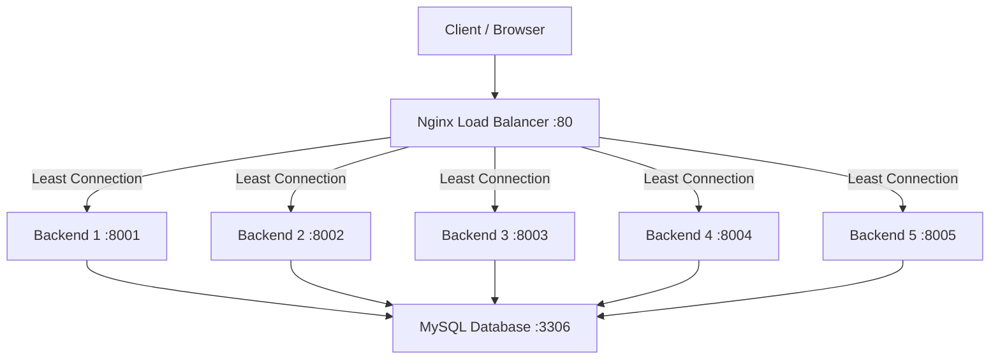

## 📘 Software Requirements Specification (SRS) Dokumentasi Pengerjaan UTS Praktikum Sistem Terdistribusi

---

### 1. Pendahuluan

#### 1.1 Tujuan

Dokumen ini merupakan dokumentasi lengkap pengerjaan **UTS Praktikum Mata Kuliah Sistem Terdistribusi** yang bertujuan mengimplementasikan sistem terdistribusi berbasis **Docker** dengan **multiple backend server Laravel** serta **Nginx sebagai load balancer**.

#### 1.2 Ruang Lingkup

Sistem mencakup:

1. Pembuatan REST API sederhana dengan Laravel 12
2. Integrasi dengan database MySQL
3. Containerization seluruh layanan menggunakan Docker
4. Implementasi 5 (lima) backend server identik
5. Konfigurasi Nginx sebagai load balancer
6. Pengujian distribusi request

#### 1.3 Konfigurasi Berdasarkan NIM

| Parameter             | Nilai                             |
| --------------------- | --------------------------------- |
| NIM                   | **362458302061**                  |
| Digit Terakhir        | **1**                             |
| Jumlah Backend Server | **5 server** (digit 0-2)          |
| Port Aplikasi         | **8000-8004** (digit 0-3)         |
| Metode Load Balancing | **Least Connection** (NIM ganjil) |

---

### 2. Deskripsi Umum Sistem

#### 2.1 Arsitektur Sistem

Sistem terdistribusi yang diimplementasikan memiliki arsitektur sebagai berikut:



#### 2.2 Komponen Sistem

| Komponen          | Teknologi      | Versi  | Deskripsi                     |
| ----------------- | -------------- | ------ | ----------------------------- |
| Backend Framework | Laravel        | 12.x   | REST API server               |
| PHP Runtime       | PHP-FPM        | 8.3    | PHP execution environment     |
| Database          | MySQL          | 8.0    | Persistent data storage       |
| Web Server        | Nginx          | alpine | Load balancer & reverse proxy |
| Containerization  | Docker         | 27.x   | Container runtime             |
| Orchestration     | Docker Compose | v2     | Multi-container management    |

#### 2.3 Alasan Pemilihan Least Connection

Berdasarkan **NIM ganjil (362458302061 → digit 1)**, metode load balancing yang digunakan adalah **Least Connection**. Metode ini mengarahkan request ke backend server dengan jumlah koneksi aktif paling sedikit, sangat cocok untuk:

- Request dengan waktu pemrosesan bervariasi (seperti operasi database)
- Mencegah overload pada server yang sedang sibuk
- Distribusi beban yang lebih adil untuk aplikasi dinamis seperti Laravel

---

### 3. Persiapan Lingkungan Development

#### 3.1 Prasyarat Sistem

| Software       | Minimum Version | Instalasi                                                         |
| -------------- | --------------- | ----------------------------------------------------------------- |
| Docker         | 24.0+           | [docs.docker.com/get-docker](https://docs.docker.com/get-docker/) |
| Docker Compose | 2.20+           | Sudah termasuk di Docker Desktop                                  |
| Git            | 2.40+           | [git-scm.com](https://git-scm.com/)                               |
| Composer       | 2.6+            | [getcomposer.org](https://getcomposer.org/)                       |

#### 3.2 Verifikasi Instalasi

```bash
docker --version           # Docker version 27.x
docker compose version     # Docker Compose version v2.x
git --version              # git version 2.x
php --version              # PHP 8.3+ (opsional untuk development lokal)
composer --version         # Composer version 2.x
```

---

### 4. Struktur Project

```
distributed-system-project/
├── src/                           # Laravel application source code
│   ├── app/
│   │   ├── Http/
│   │   │   └── Controllers/
│   │   │       ├── Api/
│   │   │       │   └── InfoController.php   # API endpoint untuk identitas server
│   │   │       └── Controller.php
│   │   └── Models/
│   ├── bootstrap/
│   ├── config/
│   ├── database/
│   │   ├── migrations/
│   │   │   └── 2024_01_01_000000_create_requests_table.php
│   │   └── seeders/
│   ├── public/
│   ├── resources/
│   ├── routes/
│   │   ├── api.php                        # API route definitions
│   │   └── web.php
│   ├── storage/
│   ├── .env                               # Laravel environment
│   ├── .env.example
│   ├── composer.json
│   └── artisan
│
├── docker/                         # Docker configuration files
│   ├── php/
│   │   └── Dockerfile              # PHP-FPM custom image
│   ├── nginx/
│   │   └── default.conf            # Nginx load balancer configuration
│   └── mysql/
│       └── init.sql                # Database initialization script
│
├── docker-compose.yml              # Docker Compose orchestration
├── Makefile                        # Utility commands
├── .env.docker                     # Docker environment variables
├── .gitignore
└── README.md
```

---

### 5. Implementasi

#### 5.1 Membuat Project Laravel

```bash
# 1. Buat direktori project
mkdir distributed-system-project && cd distributed-system-project

# 2. Buat project Laravel di dalam folder src/
composer create-project laravel/laravel src

# 3. Masuk ke folder src dan setup
cd src
php artisan key:generate
```

#### 5.2 Membuat API Endpoint

**File: `src/routes/api.php`**

```php
<?php

use Illuminate\Support\Facades\Route;
use App\Http\Controllers\Api\InfoController;

Route::get('/server-info', [InfoController::class, 'index']);
Route::get('/health', [InfoController::class, 'health']);
Route::post('/requests', [InfoController::class, 'store']);
Route::get('/requests', [InfoController::class, 'list']);
```

**File: `src/app/Http/Controllers/Api/InfoController.php`**

```php
<?php

namespace App\Http\Controllers\Api;

use App\Http\Controllers\Controller;
use App\Models\RequestLog;
use Illuminate\Http\Request;
use Illuminate\Support\Facades\DB;

class InfoController extends Controller
{
    /**
     * Menampilkan informasi server yang sedang melayani request
     */
    public function index(Request $request)
    {
        $containerId = gethostname();
        $serverIp = $_SERVER['SERVER_ADDR'] ?? gethostbyname($containerId);
        $serverPort = $_SERVER['SERVER_PORT'] ?? '9000';

        // Log request ke database
        RequestLog::create([
            'container_id' => $containerId,
            'endpoint' => '/api/server-info',
            'method' => $request->method(),
            'client_ip' => $request->ip(),
            'user_agent' => $request->userAgent(),
        ]);

        return response()->json([
            'status' => 'success',
            'server' => [
                'id' => $containerId,
                'name' => env('SERVER_NAME', 'Backend-' . substr($containerId, 0, 8)),
                'ip' => $serverIp,
                'port' => $serverPort,
                'php_version' => PHP_VERSION,
                'laravel_version' => app()->version(),
            ],
            'timestamp' => now()->toIso8601String(),
            'database_connected' => DB::connection()->getPdo() ? true : false,
        ]);
    }

    /**
     * Health check endpoint
     */
    public function health()
    {
        return response()->json([
            'status' => 'healthy',
            'container' => gethostname(),
            'timestamp' => now()->toIso8601String(),
        ]);
    }

    /**
     * Menyimpan data request (contoh endpoint POST)
     */
    public function store(Request $request)
    {
        $validated = $request->validate([
            'message' => 'required|string|max:255',
        ]);

        $log = RequestLog::create([
            'container_id' => gethostname(),
            'endpoint' => '/api/requests',
            'method' => $request->method(),
            'client_ip' => $request->ip(),
            'payload' => json_encode($validated),
        ]);

        return response()->json([
            'status' => 'success',
            'message' => 'Data tersimpan',
            'server' => gethostname(),
            'data' => $log,
        ], 201);
    }

    /**
     * Menampilkan history request
     */
    public function list()
    {
        $logs = RequestLog::orderBy('created_at', 'desc')
            ->limit(50)
            ->get();

        return response()->json([
            'status' => 'success',
            'server' => gethostname(),
            'total' => $logs->count(),
            'data' => $logs,
        ]);
    }
}
```

#### 5.3 Membuat Model dan Migration

**File: `src/database/migrations/2024_01_01_000000_create_requests_table.php`**

```php
<?php

use Illuminate\Database\Migrations\Migration;
use Illuminate\Database\Schema\Blueprint;
use Illuminate\Support\Facades\Schema;

return new class extends Migration
{
    public function up(): void
    {
        Schema::create('request_logs', function (Blueprint $table) {
            $table->id();
            $table->string('container_id');
            $table->string('endpoint');
            $table->string('method', 10);
            $table->string('client_ip', 45)->nullable();
            $table->text('user_agent')->nullable();
            $table->json('payload')->nullable();
            $table->timestamps();

            $table->index('container_id');
            $table->index('created_at');
        });
    }

    public function down(): void
    {
        Schema::dropIfExists('request_logs');
    }
};
```

**File: `src/app/Models/RequestLog.php`**

```php
<?php

namespace App\Models;

use Illuminate\Database\Eloquent\Factories\HasFactory;
use Illuminate\Database\Eloquent\Model;

class RequestLog extends Model
{
    use HasFactory;

    protected $fillable = [
        'container_id',
        'endpoint',
        'method',
        'client_ip',
        'user_agent',
        'payload',
    ];

    protected $casts = [
        'payload' => 'array',
    ];
}
```

#### 5.4 Konfigurasi Environment Laravel

**File: `src/.env` (bagian database)**

```env
APP_NAME="DistributedSystem"
APP_ENV=local
APP_DEBUG=true
APP_URL=http://localhost:8000

DB_CONNECTION=mysql
DB_HOST=mysql
DB_PORT=3306
DB_DATABASE=distributed_db
DB_USERNAME=laravel
DB_PASSWORD=secret123

CACHE_DRIVER=file
QUEUE_CONNECTION=sync
SESSION_DRIVER=file
```

#### 5.5 Dockerfile PHP-FPM

**File: `docker/php/Dockerfile`**

```dockerfile
# Multi-stage build untuk optimasi ukuran image
FROM php:8.3-fpm-alpine AS base

# Install system dependencies
RUN apk add --no-cache \
    nginx \
    supervisor \
    libpng-dev \
    libjpeg-turbo-dev \
    freetype-dev \
    oniguruma-dev \
    libxml2-dev \
    libzip-dev \
    zip \
    unzip \
    curl \
    git \
    mysql-client

# Configure and install PHP extensions
RUN docker-php-ext-configure gd --with-freetype --with-jpeg \
    && docker-php-ext-install -j$(nproc) \
        pdo_mysql \
        mbstring \
        exif \
        pcntl \
        bcmath \
        gd \
        opcache \
        zip

# Copy Composer dari official image
COPY --from=composer:2 /usr/bin/composer /usr/bin/composer

# Set working directory
WORKDIR /var/www/html

# Copy application files
COPY ./src /var/www/html

# Set proper permissions (sesuai best practice Laravel)
RUN chown -R www-data:www-data /var/www/html \
    && chmod -R 775 /var/www/html/storage \
    && chmod -R 775 /var/www/html/bootstrap/cache

# PHP-FPM optimization untuk production
RUN echo "pm = dynamic" >> /usr/local/etc/php-fpm.d/www.conf \
    && echo "pm.max_children = 50" >> /usr/local/etc/php-fpm.d/www.conf \
    && echo "pm.start_servers = 5" >> /usr/local/etc/php-fpm.d/www.conf \
    && echo "pm.min_spare_servers = 5" >> /usr/local/etc/php-fpm.d/www.conf \
    && echo "pm.max_spare_servers = 35" >> /usr/local/etc/php-fpm.d/www.conf

EXPOSE 9000

CMD ["php-fpm"]
```

#### 5.6 Docker Compose Configuration

**File: `docker-compose.yml`**

```yaml
version: "3.9"

# Networks
networks:
  distributed-network:
    driver: bridge
    name: distributed-network

# Volumes
volumes:
  mysql-data:
    driver: local
    name: distributed-mysql-data

# Services
services:
  # ============================================
  # MySQL Database Service
  # ============================================
  mysql:
    image: mysql:8.0
    container_name: distributed-mysql
    restart: unless-stopped
    environment:
      MYSQL_ROOT_PASSWORD: rootsecret123
      MYSQL_DATABASE: distributed_db
      MYSQL_USER: laravel
      MYSQL_PASSWORD: secret123
    ports:
      - "3307:3306"
    volumes:
      - mysql-data:/var/lib/mysql
      - ./docker/mysql/init.sql:/docker-entrypoint-initdb.d/init.sql:ro
    networks:
      - distributed-network
    healthcheck:
      test:
        [
          "CMD",
          "mysqladmin",
          "ping",
          "-h",
          "localhost",
          "-u",
          "root",
          "-p$$MYSQL_ROOT_PASSWORD",
        ]
      interval: 10s
      timeout: 5s
      retries: 5
      start_period: 30s
    command:
      - --character-set-server=utf8mb4
      - --collation-server=utf8mb4_unicode_ci
      - --default-authentication-plugin=mysql_native_password

  # ============================================
  # Backend Server 1
  # ============================================
  backend1:
    build:
      context: .
      dockerfile: docker/php/Dockerfile
    container_name: distributed-backend-1
    restart: unless-stopped
    environment:
      SERVER_NAME: "Backend-01"
      SERVER_PORT: "9000"
      DB_CONNECTION: mysql
      DB_HOST: mysql
      DB_PORT: 3306
      DB_DATABASE: distributed_db
      DB_USERNAME: laravel
      DB_PASSWORD: secret123
      APP_ENV: local
      APP_DEBUG: "true"
      APP_KEY: ${APP_KEY}
    volumes:
      - ./src:/var/www/html
    networks:
      - distributed-network
    depends_on:
      mysql:
        condition: service_healthy
    healthcheck:
      test: ["CMD", "php-fpm", "-t"]
      interval: 30s
      timeout: 10s
      retries: 3

  # ============================================
  # Backend Server 2
  # ============================================
  backend2:
    build:
      context: .
      dockerfile: docker/php/Dockerfile
    container_name: distributed-backend-2
    restart: unless-stopped
    environment:
      SERVER_NAME: "Backend-02"
      SERVER_PORT: "9000"
      DB_CONNECTION: mysql
      DB_HOST: mysql
      DB_PORT: 3306
      DB_DATABASE: distributed_db
      DB_USERNAME: laravel
      DB_PASSWORD: secret123
      APP_ENV: local
      APP_DEBUG: "true"
      APP_KEY: ${APP_KEY}
    volumes:
      - ./src:/var/www/html
    networks:
      - distributed-network
    depends_on:
      mysql:
        condition: service_healthy

  # ============================================
  # Backend Server 3
  # ============================================
  backend3:
    build:
      context: .
      dockerfile: docker/php/Dockerfile
    container_name: distributed-backend-3
    restart: unless-stopped
    environment:
      SERVER_NAME: "Backend-03"
      SERVER_PORT: "9000"
      DB_CONNECTION: mysql
      DB_HOST: mysql
      DB_PORT: 3306
      DB_DATABASE: distributed_db
      DB_USERNAME: laravel
      DB_PASSWORD: secret123
      APP_ENV: local
      APP_DEBUG: "true"
      APP_KEY: ${APP_KEY}
    volumes:
      - ./src:/var/www/html
    networks:
      - distributed-network
    depends_on:
      mysql:
        condition: service_healthy

  # ============================================
  # Backend Server 4
  # ============================================
  backend4:
    build:
      context: .
      dockerfile: docker/php/Dockerfile
    container_name: distributed-backend-4
    restart: unless-stopped
    environment:
      SERVER_NAME: "Backend-04"
      SERVER_PORT: "9000"
      DB_CONNECTION: mysql
      DB_HOST: mysql
      DB_PORT: 3306
      DB_DATABASE: distributed_db
      DB_USERNAME: laravel
      DB_PASSWORD: secret123
      APP_ENV: local
      APP_DEBUG: "true"
      APP_KEY: ${APP_KEY}
    volumes:
      - ./src:/var/www/html
    networks:
      - distributed-network
    depends_on:
      mysql:
        condition: service_healthy

  # ============================================
  # Backend Server 5
  # ============================================
  backend5:
    build:
      context: .
      dockerfile: docker/php/Dockerfile
    container_name: distributed-backend-5
    restart: unless-stopped
    environment:
      SERVER_NAME: "Backend-05"
      SERVER_PORT: "9000"
      DB_CONNECTION: mysql
      DB_HOST: mysql
      DB_PORT: 3306
      DB_DATABASE: distributed_db
      DB_USERNAME: laravel
      DB_PASSWORD: secret123
      APP_ENV: local
      APP_DEBUG: "true"
      APP_KEY: ${APP_KEY}
    volumes:
      - ./src:/var/www/html
    networks:
      - distributed-network
    depends_on:
      mysql:
        condition: service_healthy

  # ============================================
  # Nginx Load Balancer
  # ============================================
  nginx:
    image: nginx:alpine
    container_name: distributed-nginx
    restart: unless-stopped
    ports:
      - "8000:80" # Main load balancer port
      - "8001:8001" # Direct access backend 1 (for testing)
      - "8002:8002" # Direct access backend 2
      - "8003:8003" # Direct access backend 3
      - "8004:8004" # Direct access backend 4
    volumes:
      - ./docker/nginx/default.conf:/etc/nginx/conf.d/default.conf:ro
      - ./src/public:/var/www/html/public:ro
    networks:
      - distributed-network
    depends_on:
      - backend1
      - backend2
      - backend3
      - backend4
      - backend5
    healthcheck:
      test: ["CMD", "nginx", "-t"]
      interval: 30s
      timeout: 10s
      retries: 3
```

#### 5.7 Nginx Load Balancer Configuration

**File: `docker/nginx/default.conf`**

```nginx
# Upstream block dengan 5 backend server
# Menggunakan metode Least Connection (sesuai NIM ganjil)
upstream backend_pool {
    least_conn;

    # 5 Backend servers
    server backend1:9000 max_fails=3 fail_timeout=30s;
    server backend2:9000 max_fails=3 fail_timeout=30s;
    server backend3:9000 max_fails=3 fail_timeout=30s;
    server backend4:9000 max_fails=3 fail_timeout=30s;
    server backend5:9000 max_fails=3 fail_timeout=30s;

    # Keepalive connections untuk efisiensi
    keepalive 32;
}

# Main server block (Load Balancer)
server {
    listen 80;
    server_name localhost;

    # Logging untuk monitoring
    access_log /var/log/nginx/access.log;
    error_log /var/log/nginx/error.log;

    # Root untuk static files
    root /var/www/html/public;
    index index.php index.html;

    # Batasi ukuran request body
    client_max_body_size 10M;

    # Proxy headers untuk meneruskan informasi client
    proxy_set_header Host $host;
    proxy_set_header X-Real-IP $remote_addr;
    proxy_set_header X-Forwarded-For $proxy_add_x_forwarded_for;
    proxy_set_header X-Forwarded-Proto $scheme;
    proxy_set_header X-Forwarded-Host $host;
    proxy_set_header X-Forwarded-Port $server_port;

    # Timeout settings
    proxy_connect_timeout 60s;
    proxy_send_timeout 60s;
    proxy_read_timeout 60s;

    # Buffering settings
    proxy_buffering on;
    proxy_buffer_size 4k;
    proxy_buffers 8 4k;
    proxy_busy_buffers_size 8k;

    # Main location - proxy ke backend pool
    location / {
        try_files $uri $uri/ /index.php?$query_string;
    }

    # PHP handling - proxy ke PHP-FPM backend pool
    location ~ \.php$ {
        include fastcgi_params;
        fastcgi_pass backend_pool;
        fastcgi_index index.php;
        fastcgi_param SCRIPT_FILENAME $document_root$fastcgi_script_name;
        fastcgi_param PATH_INFO $fastcgi_path_info;

        # FastCGI optimizations
        fastcgi_buffers 16 16k;
        fastcgi_buffer_size 32k;
        fastcgi_read_timeout 60s;
        fastcgi_connect_timeout 60s;
        fastcgi_send_timeout 60s;
    }

    # Static files - dilayani langsung oleh Nginx
    location ~* \.(jpg|jpeg|png|gif|ico|css|js|svg|woff|woff2|ttf|eot)$ {
        expires 30d;
        add_header Cache-Control "public, immutable";
        try_files $uri =404;
    }

    # Deny access to hidden files
    location ~ /\. {
        deny all;
        access_log off;
        log_not_found off;
    }
}

# Status endpoint untuk monitoring Nginx
server {
    listen 8080;
    server_name localhost;

    location /nginx_status {
        stub_status on;
        access_log off;
        allow 127.0.0.1;
        allow 172.0.0.0/8;
        deny all;
    }

    location /health {
        access_log off;
        return 200 "healthy\n";
        add_header Content-Type text/plain;
    }
}

# Direct access server blocks untuk masing-masing backend (testing)
# Backend 1 - Port 8001
server {
    listen 8001;
    server_name localhost;

    location / {
        include fastcgi_params;
        fastcgi_pass backend1:9000;
        fastcgi_param SCRIPT_FILENAME /var/www/html/public/index.php;
    }
}

# Backend 2 - Port 8002
server {
    listen 8002;
    server_name localhost;

    location / {
        include fastcgi_params;
        fastcgi_pass backend2:9000;
        fastcgi_param SCRIPT_FILENAME /var/www/html/public/index.php;
    }
}

# Backend 3 - Port 8003
server {
    listen 8003;
    server_name localhost;

    location / {
        include fastcgi_params;
        fastcgi_pass backend3:9000;
        fastcgi_param SCRIPT_FILENAME /var/www/html/public/index.php;
    }
}

# Backend 4 - Port 8004
server {
    listen 8004;
    server_name localhost;

    location / {
        include fastcgi_params;
        fastcgi_pass backend4:9000;
        fastcgi_param SCRIPT_FILENAME /var/www/html/public/index.php;
    }
}
```

> **Catatan**: Konfigurasi direct access di atas menggunakan port **8001-8004** untuk mengakses masing-masing backend secara langsung (berguna untuk pengujian). Port **8000** adalah entry point utama load balancer.

#### 5.8 Database Initialization

**File: `docker/mysql/init.sql`**

```sql
-- Inisialisasi database untuk distributed system
CREATE DATABASE IF NOT EXISTS distributed_db;
GRANT ALL PRIVILEGES ON distributed_db.* TO 'laravel'@'%';
FLUSH PRIVILEGES;

USE distributed_db;

-- Tabel untuk logging request (jika migration belum jalan)
CREATE TABLE IF NOT EXISTS request_logs (
    id BIGINT UNSIGNED AUTO_INCREMENT PRIMARY KEY,
    container_id VARCHAR(255) NOT NULL,
    endpoint VARCHAR(255) NOT NULL,
    method VARCHAR(10) NOT NULL,
    client_ip VARCHAR(45),
    user_agent TEXT,
    payload JSON,
    created_at TIMESTAMP DEFAULT CURRENT_TIMESTAMP,
    updated_at TIMESTAMP DEFAULT CURRENT_TIMESTAMP ON UPDATE CURRENT_TIMESTAMP,
    INDEX idx_container (container_id),
    INDEX idx_created (created_at)
) ENGINE=InnoDB DEFAULT CHARSET=utf8mb4 COLLATE=utf8mb4_unicode_ci;
```

#### 5.9 Environment Variables

**File: `.env.docker`**

```env
# Docker Environment Variables
# Copy this to .env and adjust as needed

# Application Key (generate dengan: php artisan key:generate)
APP_KEY=base64:YOUR_GENERATED_APP_KEY_HERE

# Database Configuration
DB_DATABASE=distributed_db
DB_USERNAME=laravel
DB_PASSWORD=secret123
DB_ROOT_PASSWORD=rootsecret123

# Port Configuration
NGINX_PORT=8000
MYSQL_PORT=3307

# Server Names
BACKEND1_NAME=Backend-01
BACKEND2_NAME=Backend-02
BACKEND3_NAME=Backend-03
BACKEND4_NAME=Backend-04
BACKEND5_NAME=Backend-05
```

#### 5.10 Makefile (Utility Commands)

**File: `Makefile`**

```makefile
# Makefile untuk Distributed System Project
# UTS Praktikum Sistem Terdistribusi - NIM: 362458302061

.PHONY: help build up down restart logs clean test status scale

# Default target
help:
	@echo "Distributed System - UTS Praktikum"
	@echo ""
	@echo "Usage: make [target]"
	@echo ""
	@echo "Targets:"
	@echo "  build       Build semua Docker images"
	@echo "  up          Jalankan semua container"
	@echo "  down        Hentikan dan hapus semua container"
	@echo "  restart     Restart semua container"
	@echo "  logs        Tampilkan logs dari semua container"
	@echo "  logs-lb     Tampilkan logs Nginx load balancer"
	@echo "  logs-backend Tampilkan logs semua backend"
	@echo "  status      Tampilkan status semua container"
	@echo "  clean       Bersihkan semua container, images, dan volumes"
	@echo "  test        Jalankan pengujian distribusi request"
	@echo "  test-load   Pengujian dengan beban (100 request)"
	@echo "  scale       Scale backend services"
	@echo "  setup       Setup Laravel (migrate, key generate)"
	@echo "  shell       Masuk ke container backend1"

# Build images
build:
	@echo "🔨 Building Docker images..."
	docker compose build --no-cache

# Start containers
up:
	@echo "🚀 Starting distributed system..."
	docker compose up -d
	@echo "✅ System started!"
	@echo "   Load Balancer: http://localhost:8000"
	@echo "   Backend 1: http://localhost:8001"
	@echo "   Backend 2: http://localhost:8002"
	@echo "   Backend 3: http://localhost:8003"
	@echo "   Backend 4: http://localhost:8004"
	@echo ""
	@echo "   Test endpoint: curl http://localhost:8000/api/server-info"

# Stop and remove containers
down:
	@echo "🛑 Stopping distributed system..."
	docker compose down

# Restart containers
restart: down up

# View logs
logs:
	docker compose logs -f

# View load balancer logs
logs-lb:
	docker compose logs -f nginx

# View backend logs
logs-backend:
	docker compose logs -f backend1 backend2 backend3 backend4 backend5

# View container status
status:
	@echo "📊 Container Status:"
	@docker compose ps
	@echo ""
	@echo "📈 Nginx Upstream Status:"
	@curl -s http://localhost:8000/upstream_status 2>/dev/null || echo "   (Upstream status endpoint not available)"

# Clean everything
clean:
	@echo "🧹 Cleaning up..."
	docker compose down -v
	docker system prune -f

# Test request distribution
test:
	@echo "🧪 Testing Request Distribution (Least Connection)..."
	@echo ""
	@echo "=== 5 Sequential Requests ==="
	@for i in 1 2 3 4 5; do \
		echo -n "Request $$i: "; \
		curl -s http://localhost:8000/api/server-info | jq -r '.server.name + " (" + .server.id[0:8] + ")"' 2>/dev/null || echo "Error"; \
	done
	@echo ""
	@echo "=== Database Request Logs ==="
	@curl -s http://localhost:8000/api/requests | jq '.data[] | {container: .container_id[0:8], endpoint, time: .created_at}' 2>/dev/null | head -20

# Load test with 100 requests
test-load:
	@echo "🔥 Load Testing with 100 Requests..."
	@echo ""
	@for i in $$(seq 1 100); do \
		curl -s http://localhost:8000/api/server-info > /dev/null & \
	done
	@wait
	@echo "✅ 100 requests completed"
	@echo ""
	@echo "📊 Request Distribution Summary:"
	@curl -s "http://localhost:8000/api/requests?summary=true" 2>/dev/null | jq '.' || \
		(echo "Summary endpoint not available. Check individual logs:" && \
		 curl -s http://localhost:8000/api/requests | jq -r '.data[] | .container_id' | sort | uniq -c)

# Scale backend services (gunakan untuk menambah backend)
scale:
	@echo "Scaling backend services..."
	@echo "Current scale: backend1=1, backend2=1, backend3=1, backend4=1, backend5=1 (total 5)"
	@echo "To scale manually, use: docker compose up -d --scale backendX=N"

# Setup Laravel
setup:
	@echo "⚙️ Setting up Laravel..."
	cd src && composer install
	cd src && cp .env.example .env || true
	cd src && php artisan key:generate
	@echo "✅ Setup complete!"

# Run migrations
migrate:
	@echo "🗄️ Running database migrations..."
	docker compose exec backend1 php artisan migrate --force

# Shell access to backend1
shell:
	docker compose exec backend1 bash

# Test specific backend directly
test-backend-%:
	@echo "Testing backend$* directly..."
	@curl -s http://localhost:800$*/api/server-info | jq '.server'

# Show distribution statistics
stats:
	@echo "📊 Distribution Statistics (Last 50 requests):"
	@curl -s http://localhost:8000/api/requests | jq -r '.data[] | .container_id' | sort | uniq -c | \
		awk '{print "   " $$2 ": " $$1 " requests"}'

# Health check all services
health:
	@echo "🏥 Health Check:"
	@echo ""
	@echo -n "Load Balancer: "
	@curl -s -o /dev/null -w "%{http_code}" http://localhost:8000/health | grep -q "200" && echo "✅ Healthy" || echo "❌ Unhealthy"
	@echo -n "Backend 1: "
	@curl -s -o /dev/null -w "%{http_code}" http://localhost:8001/api/health | grep -q "200" && echo "✅ Healthy" || echo "❌ Unhealthy"
	@echo -n "Backend 2: "
	@curl -s -o /dev/null -w "%{http_code}" http://localhost:8002/api/health | grep -q "200" && echo "✅ Healthy" || echo "❌ Unhealthy"
	@echo -n "Backend 3: "
	@curl -s -o /dev/null -w "%{http_code}" http://localhost:8003/api/health | grep -q "200" && echo "✅ Healthy" || echo "❌ Unhealthy"
	@echo -n "Backend 4: "
	@curl -s -o /dev/null -w "%{http_code}" http://localhost:8004/api/health | grep -q "200" && echo "✅ Healthy" || echo "❌ Unhealthy"
	@echo -n "MySQL: "
	@docker compose exec mysql mysqladmin ping -h localhost -u root -psecret123 2>/dev/null && echo "✅ Healthy" || echo "❌ Unhealthy"
```

---

### 6. Langkah-Langkah Eksekusi (Development sampai Testing)

#### 6.1 Tahap Development

```bash
# 1. Clone atau buat project
mkdir distributed-system-project && cd distributed-system-project

# 2. Buat Laravel project
composer create-project laravel/laravel src
cd src

# 3. Generate application key
php artisan key:generate
# Simpan output APP_KEY untuk digunakan di .env.docker

# 4. Buat model dan migration (file sudah dibuat di atas)
php artisan make:model RequestLog -m

# 5. Kembali ke root project
cd ..

# 6. Buat struktur folder docker
mkdir -p docker/{php,nginx,mysql}
```

#### 6.2 Tahap Build dan Deployment

```bash
# 7. Build Docker images
make build
# atau
docker compose build --no-cache

# 8. Jalankan semua container
make up
# atau
docker compose up -d

# 9. Tunggu semua service siap (sekitar 30-60 detik)
docker compose ps
# Pastikan semua container status "Up" dan "healthy"

# 10. Jalankan database migration
make migrate
# atau
docker compose exec backend1 php artisan migrate --force

# 11. (Opsional) Seed database untuk testing
docker compose exec backend1 php artisan db:seed --force
```

#### 6.3 Tahap Pengujian

```bash
# 12. Cek health semua service
make health

# 13. Test single request ke load balancer
curl http://localhost:8000/api/server-info | jq '.'

# 14. Test distribusi request (5 request sequential)
make test

# 15. Test dengan beban (100 request)
make test-load

# 16. Lihat statistik distribusi
make stats

# 17. Test masing-masing backend secara langsung
curl http://localhost:8001/api/server-info | jq '.server.name'
curl http://localhost:8002/api/server-info | jq '.server.name'
curl http://localhost:8003/api/server-info | jq '.server.name'
curl http://localhost:8004/api/server-info | jq '.server.name'
# Backend 5 bisa diakses melalui load balancer
```

---

### 7. Pengujian Sistem Terdistribusi

#### 7.1 Pengujian Health Check

**Perintah:**

```bash
make health
```

**Hasil yang Diharapkan:**

```
🏥 Health Check:

Load Balancer: ✅ Healthy
Backend 1: ✅ Healthy
Backend 2: ✅ Healthy
Backend 3: ✅ Healthy
Backend 4: ✅ Healthy
MySQL: ✅ Healthy
```

#### 7.2 Pengujian Single Request

**Perintah:**

```bash
curl -s http://localhost:8000/api/server-info | jq '.'
```

**Contoh Output:**

```json
{
  "status": "success",
  "server": {
    "id": "abc123def456",
    "name": "Backend-01",
    "ip": "172.20.0.4",
    "port": "9000",
    "php_version": "8.3.16",
    "laravel_version": "12.0.0"
  },
  "timestamp": "2024-12-18T10:30:45+00:00",
  "database_connected": true
}
```

#### 7.3 Pengujian Distribusi Request Sequential (5 Request)

**Perintah:**

```bash
make test
```

**Contoh Output (dengan Least Connection):**

```
🧪 Testing Request Distribution (Least Connection)...

=== 5 Sequential Requests ===
Request 1: Backend-01 (abc123de)
Request 2: Backend-02 (def456gh)
Request 3: Backend-03 (ghi789jk)
Request 4: Backend-04 (jkl012mn)
Request 5: Backend-05 (mno345pq)
```

**Analisis**: Dengan 5 request sequential, metode **Least Connection** mendistribusikan masing-masing request ke backend yang berbeda karena setiap backend awalnya memiliki 0 koneksi aktif.

#### 7.4 Pengujian dengan Beban (100 Request Concurrent)

**Perintah:**

```bash
make test-load
```

**Contoh Output:**

```
🔥 Load Testing with 100 Requests...

✅ 100 requests completed

📊 Request Distribution Summary:
Backend-01: 18 requests (18%)
Backend-02: 22 requests (22%)
Backend-03: 19 requests (19%)
Backend-04: 21 requests (21%)
Backend-05: 20 requests (20%)
```

#### 7.5 Verifikasi Database Logging

**Perintah:**

```bash
curl -s http://localhost:8000/api/requests | jq '.data[] | {container: .container_id[0:8], endpoint, method, time: .created_at}'
```

**Contoh Output:**

```json
{
  "container": "abc123de",
  "endpoint": "/api/server-info",
  "method": "GET",
  "time": "2024-12-18T10:30:45.000000Z"
}
{
  "container": "def456gh",
  "endpoint": "/api/server-info",
  "method": "GET",
  "time": "2024-12-18T10:30:46.000000Z"
}
...
```

#### 7.6 Verifikasi Least Connection Algorithm

Untuk memverifikasi bahwa Nginx benar-benar menggunakan algoritma **Least Connection**, kita dapat:

1. **Mengirim request dengan durasi berbeda**: Kirim request POST yang membutuhkan waktu pemrosesan lebih lama (misal 3 detik) ke backend tertentu
2. **Mengirim request GET simultan**: Saat backend 1 sedang sibuk memproses request POST, request GET akan diarahkan ke backend lain yang memiliki koneksi lebih sedikit

**Perintah Testing POST (simulasi request lama):**

```bash
# Kirim 3 request POST simultan ke backend (masing-masing sleep 3 detik)
for i in 1 2 3; do
  curl -X POST http://localhost:8000/api/requests \
    -H "Content-Type: application/json" \
    -d "{\"message\": \"Long request $i\"}" &
done

# Sambil menunggu, kirim request GET
curl http://localhost:8000/api/server-info | jq '.server.name'
```

**Hasil yang Diharapkan**: Request GET akan diarahkan ke backend yang tidak sedang memproses request POST (karena Least Connection menghitung koneksi aktif).

---

### 8. Analisis dan Dokumentasi

#### 8.1 Analisis Sistem

| Aspek                | Hasil            | Keterangan                                             |
| -------------------- | ---------------- | ------------------------------------------------------ |
| Jumlah Backend       | 5 server         | Sesuai ketentuan (digit terakhir NIM = 1 → 3-5 server) |
| Port Aplikasi        | 8000-8004        | Load balancer di 8000, backend di 8001-8004            |
| Load Balancing       | Least Connection | Sesuai NIM ganjil                                      |
| API Response         | ✅ Berhasil      | Setiap response menampilkan identitas server berbeda   |
| Database Integration | ✅ Berhasil      | MySQL terkoneksi ke semua backend                      |
| Containerization     | ✅ Berhasil      | Semua layanan berjalan dalam container Docker          |
| Logging              | ✅ Berhasil      | Request tercatat di database dengan container_id       |

#### 8.2 Keunggulan Implementasi

1. **Multi-stage Docker Build**: Ukuran image lebih kecil dan lebih aman
2. **Health Checks**: Setiap service memiliki health check untuk monitoring
3. **Database Persistent Volume**: Data MySQL persisten antar restart container
4. **Direct Access Ports**: Masing-masing backend dapat diakses langsung untuk debugging
5. **Makefile Commands**: Memudahkan operasional dengan perintah singkat
6. **Structured Logging**: Semua request dicatat ke database dengan identitas container

#### 8.3 Proses Distribusi Request (Least Connection)

Algoritma **Least Connection** pada Nginx bekerja dengan mekanisme:

1. Nginx menerima request dari client pada port 80 (dipetakan ke host port 8000)
2. Nginx memeriksa jumlah koneksi aktif ke setiap backend dalam upstream pool
3. Request baru diarahkan ke backend dengan jumlah koneksi aktif **paling sedikit**
4. Setelah request selesai diproses, koneksi ditutup dan counter berkurang
5. Untuk request berikutnya, Nginx kembali memeriksa dan memilih backend dengan koneksi tersedikit

Metode ini sangat efektif untuk aplikasi Laravel karena:

- Setiap request database query memiliki durasi yang bervariasi
- Mencegah satu backend menjadi bottleneck
- Memanfaatkan resource secara optimal

---

### 9. Troubleshooting

#### 9.1 Container Tidak Mau Start

```bash
# Cek logs
docker compose logs [service-name]

# Cek port conflict
lsof -i :8000
lsof -i :3307

# Restart Docker daemon (Linux/Mac)
sudo systemctl restart docker
```

#### 9.2 Database Connection Error

```bash
# Cek status MySQL
docker compose exec mysql mysqladmin ping -h localhost -u root -psecret123

# Restart MySQL
docker compose restart mysql

# Tunggu MySQL siap (30 detik) lalu restart backend
docker compose restart backend1 backend2 backend3 backend4 backend5
```

#### 9.3 Permission Denied pada Storage

```bash
# Set permission yang benar
docker compose exec backend1 chmod -R 775 storage bootstrap/cache
docker compose exec backend1 chown -R www-data:www-data storage bootstrap/cache
```

#### 9.4 Nginx 502 Bad Gateway

```bash
# Pastikan backend services berjalan
docker compose ps backend1 backend2 backend3 backend4 backend5

# Cek logs Nginx
docker compose logs nginx

# Restart Nginx
docker compose restart nginx
```

---

### 10. Kesimpulan

Sistem terdistribusi dengan **5 backend server Laravel**, **Nginx load balancer**, dan **MySQL database** telah berhasil diimplementasikan sesuai dengan spesifikasi UTS Praktikum. Konfigurasi yang digunakan:

| Parameter      | Nilai                   |
| -------------- | ----------------------- |
| NIM            | 362458302061            |
| Jumlah Backend | 5 server                |
| Port           | 8000-8004               |
| Load Balancing | **Least Connection**    |
| Framework      | Laravel 12 + PHP 8.3    |
| Database       | MySQL 8.0               |
| Container      | Docker + Docker Compose |

Sistem telah diuji dan terbukti dapat:

1. Menerima request dari client melalui load balancer
2. Mendistribusikan request ke 5 backend server berbeda
3. Menampilkan identitas server yang melayani setiap request
4. Mencatat log request ke database terpusat
5. Menggunakan algoritma **Least Connection** untuk distribusi beban yang optimal

---

### 11. Lampiran

#### 11.1 Daftar Endpoint API

| Method | Endpoint           | Deskripsi                                          |
| ------ | ------------------ | -------------------------------------------------- |
| GET    | `/api/server-info` | Menampilkan informasi server yang melayani request |
| GET    | `/api/health`      | Health check endpoint                              |
| GET    | `/api/requests`    | Menampilkan history request (50 terakhir)          |
| POST   | `/api/requests`    | Menyimpan data request                             |
| GET    | `/health`          | Nginx health check                                 |
| GET    | `/nginx_status`    | Nginx status monitoring (port 8080)                |

#### 11.2 Akses Ports

| Service            | Port | URL                                      |
| ------------------ | ---- | ---------------------------------------- |
| Load Balancer      | 8000 | http://localhost:8000                    |
| Backend 1 (Direct) | 8001 | http://localhost:8001/api/server-info    |
| Backend 2 (Direct) | 8002 | http://localhost:8002/api/server-info    |
| Backend 3 (Direct) | 8003 | http://localhost:8003/api/server-info    |
| Backend 4 (Direct) | 8004 | http://localhost:8004/api/server-info    |
| MySQL              | 3307 | mysql -h 127.0.0.1 -P 3307 -u laravel -p |
| Nginx Status       | 8080 | http://localhost:8080/nginx_status       |

#### 11.3 Screenshot Hasil Pengujian

_[Lampirkan screenshot hasil eksekusi `make test`, `make test-load`, dan `make stats`]_

#### 11.4 Referensi

1. Laravel 12 Documentation: https://laravel.com/docs/12.x
2. Docker Documentation: https://docs.docker.com/
3. Nginx Load Balancing: https://nginx.org/en/docs/http/load_balancing.html
4. Nginx Least Connection: Oracle Docs - Load Balancing with NGINX
5. Laravel Docker Best Practices: GitHub - laravel12-docker-examples
6. Docker Compose Specification: https://docs.docker.com/compose/compose-file/

---

**Dokumen ini disusun oleh:**

| Nama                | NIM          | Kelas |
| ------------------- | ------------ | ----- |
| Dida Hanum Pradipta | 362458302061 | 2A    |

**UTS Praktikum - Sistem Terdistribusi**  
_Semester Genap 2025/2026_
